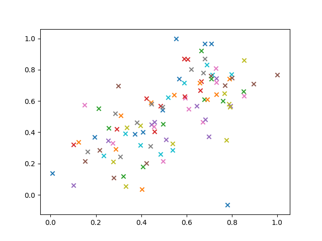
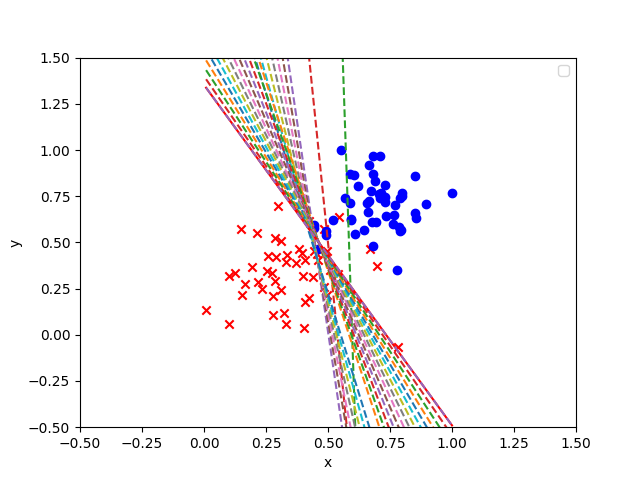

# Algorithm

编写感知器算法

感知器步骤如下所示。对于坐标轴为 $(p,q)$ 的点，标签 y，以及等式 $\hat{y} = step(w_1x_1 + w_2x_2 + b)$ 给出的预测

- 如果点分类正确，则什么也不做。
- 如果点分类为正，但是标签为负，则分别减去 $\alpha p$,$\alpha q$ 和 $\alpha$至$w_1, w_2$ 和 b
- 如果点分类为负，但是标签为正，则分别将 $\alpha p, \alpha q$ 和 $\alpha$加到 $w_1, w_2$和$b$上.

# Read csv data

```python
with open('data.csv') as f:
    f_csv = csv.reader(f)
    for row in f_csv:
        x = row[0:2]
        y = row[2]  # label
        X.append([float(x[0]), float(x[1])])
        Y.append(float(y))

X = np.array(X)
Y = np.array(Y)
```



# Result

